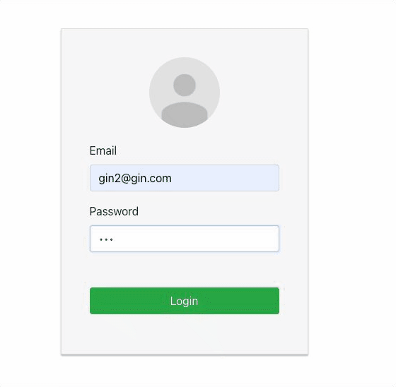

# react_login

## Installation:
      
      git clone https://github.com/ginguan/react_login.git
      
In server folder:

      npm install
      node server.js
      
In client folder:

      npm install
      npm start
      
## Screenshots:

### Page 1 = Login.
  - Links to mongo atlas to authenticate with email and password

  
  
  - if no user found or wrong password entered
  

  
  

  
 
### Page 2 = Create User
  - Create a user with fields: Email, Password, username and attach an image.
  - Supports User Authentication (Registation, Login) & Authorization with JSONWebToken (JWT)
  
  - Once you upload the profile image, it will display on the page
  
   
   
  - if using same email, it will fail to to sign up
  
  
  

### Page 3 = Authenticated
  - Display the associated image and username, email on this page.
  
  - Press logout link to logout
  
  

